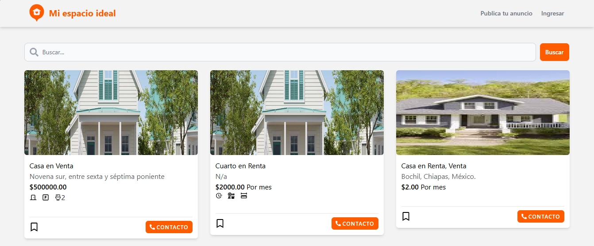
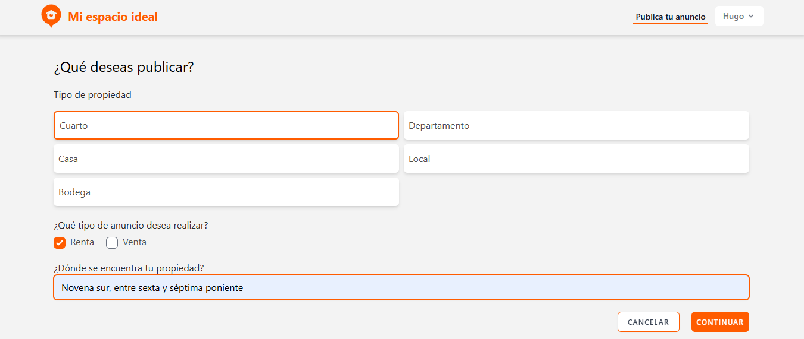
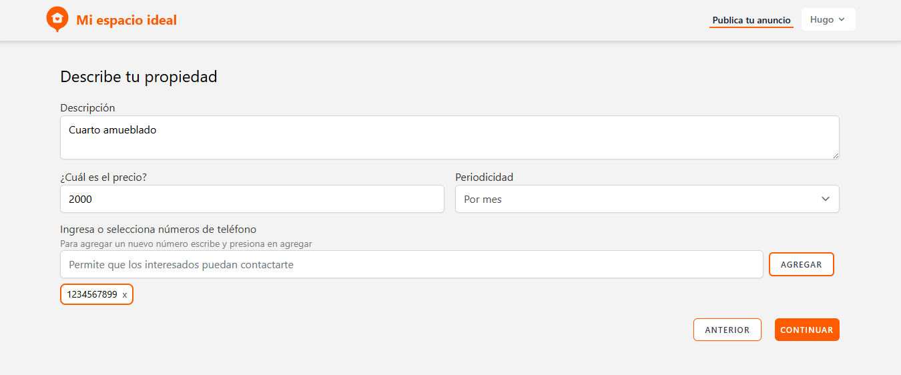
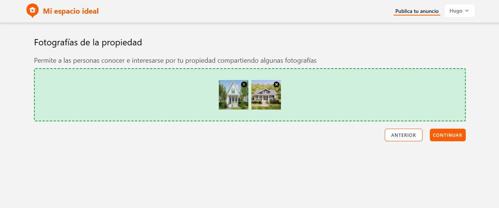
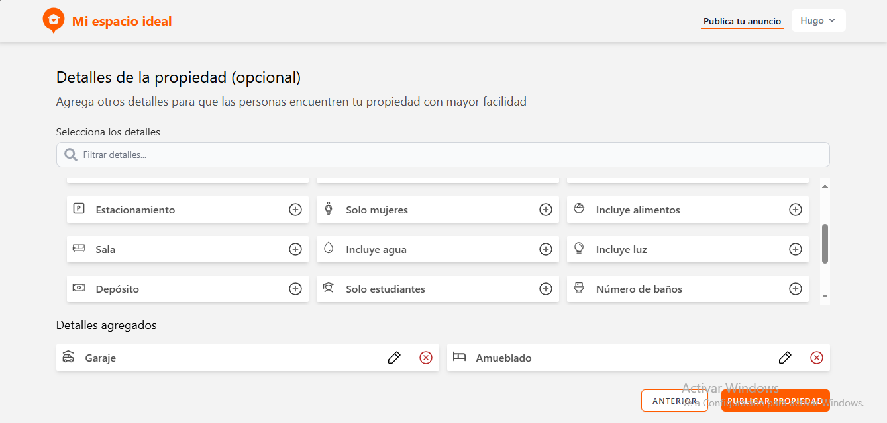

# Mi Espacio Ideal Front

Mi Espacio Ideal is a website where users can find and post information about land, apartments, houses, and other properties for rent or sale. This repository contains the **frontend** built with **React**. The backend API is a separate Laravel project available [here](https://github.com/hugoruiz00/miespacioideal-api).

## Features

* User registration and authentication
* Search properties
* Post properties with images, details, and descriptions
* Google login integration

## Installation

Clone the repository:

```
git clone https://github.com/hugoruiz00/miespacioideal-front.git
cd miespacioideal-front
```

Install dependencies:

```
npm install
```

## Running the Application

Configure the backend URL in the .env changing the VITE_API_BASE_URL variable:

```
VITE_API_BASE_URL=http://localhost:8000
```

Start the development server:

```
npm run dev
```

The frontend will be available at `http://localhost:3000`

## Backend

The backend for this project is built with Laravel and can be found [here](https://github.com/hugoruiz00/miespacioideal-api). Make sure the backend is running before using the frontend.


## License

This project is licensed under the MIT License - see the [LICENSE](LICENSE) file for details.


### Screenshots

##### Home - List of properties


##### Login


##### Create - Step one


##### Create - Step two


##### Create - Step three


##### Create - Step four

